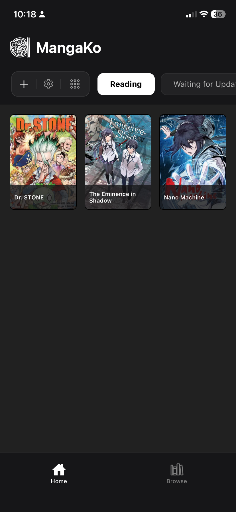
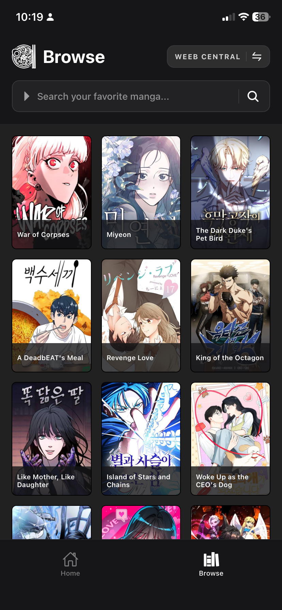
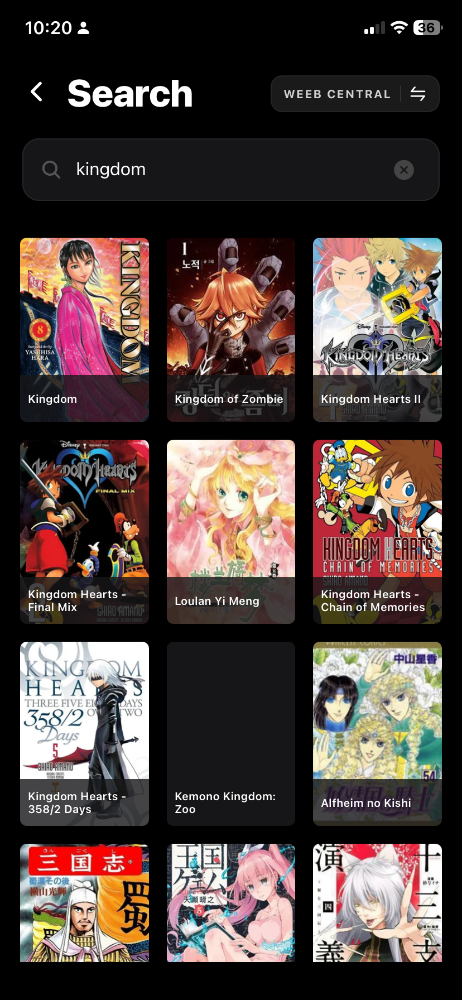
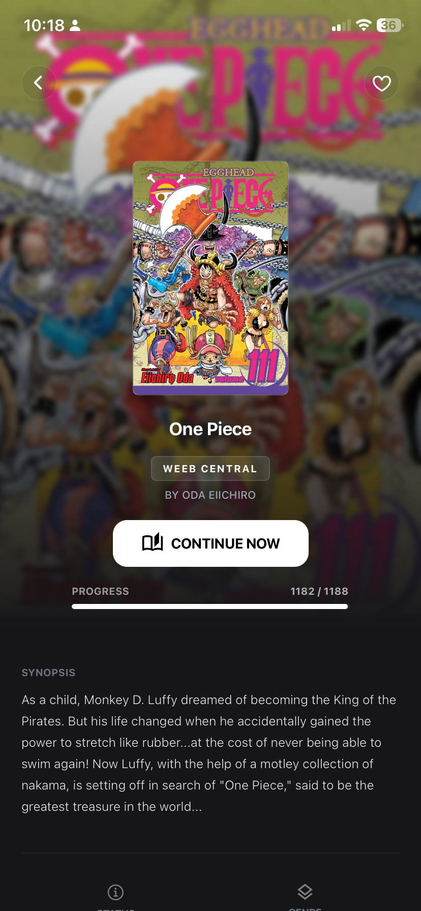
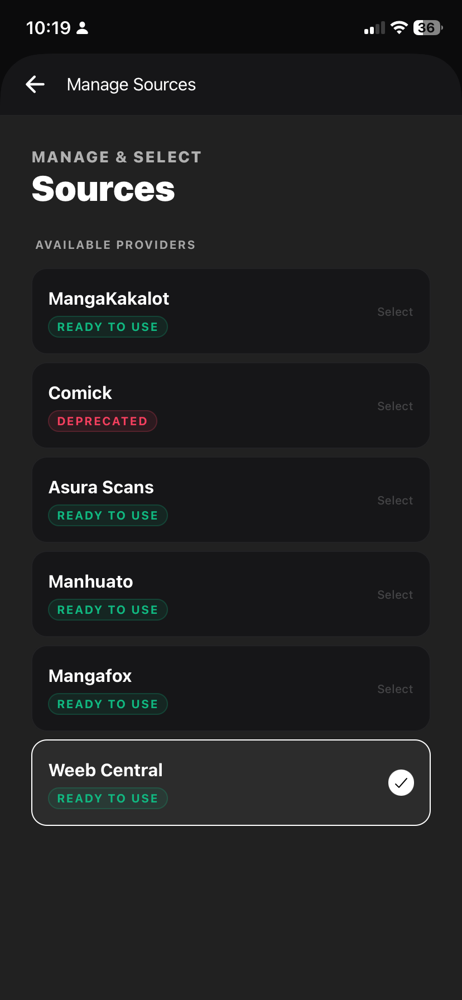
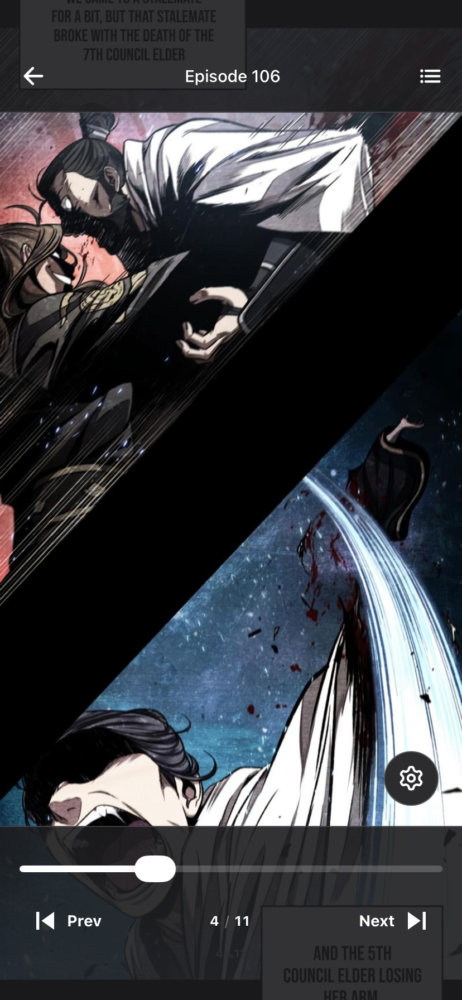

# MangaKo v3

A modern manga reader app built with Expo and React Native. Browse, search, and read manga from multiple sources with a clean, dark-themed interface.

## Screenshots

| Home | Browse | Search | Manga Info | Source Selection |
|:---:|:---:|:---:|:---:|:---:|
|  |  |  |  |  |

### Reader

| Manga | Manhwa |
|:---:|:---:|
|  |  |

## Features

- **Multiple Sources** - Browse manga from various sources with easy switching
- **Library Management** - Organize manga with categories
- **Reading Progress** - Track your reading progress automatically
- **Dark Theme** - Easy on the eyes for extended reading sessions
- **Offline Support** - Local database for cached data

## Tech Stack

- **Framework:** Expo SDK 54 + React Native
- **Styling:** NativeWind (Tailwind CSS)
- **State:** Zustand
- **Database:** SQLite (expo-sqlite)
- **Navigation:** Expo Router
- **Data Fetching:** TanStack React Query

## Getting Started

### Prerequisites

- Node.js 18+
- npm or yarn
- Expo CLI

### Installation

```bash
# Clone the repository
git clone https://github.com/your-username/mangako-v3.git

# Navigate to project
cd mangako-v3

# Install dependencies
npm install
```

### Running the App

```bash
# Start Expo server
npx expo start

# Run on Android
npm run android

# Run on iOS
npm run ios

# Run on Web
npm run web
```

### Building

```bash
# Install EAS CLI
npm install -g eas-cli

# Build for Android
eas build -p android

# Build for iOS
eas build -p ios
```

## Project Structure

```
mangako-v3/
├── app/                    # Expo Router pages
│   ├── (tabs)/            # Tab navigation
│   │   ├── index.tsx      # Home screen
│   │   └── browse.tsx     # Library/Browse screen
│   ├── (modals)/          # Modal screens
│   ├── manga/             # Manga detail & reader
│   └── search.tsx         # Search screen
├── components/            # Reusable UI components
├── hooks/                 # Custom React hooks
├── lib/                   # Utility libraries
├── services/              # API & database services
│   └── db/               # SQLite database layer
├── stores/                # Zustand state stores
├── types/                 # TypeScript type definitions
└── utils/                 # Helper utilities
```

## License

This project is licensed under the MIT License - see the [LICENSE](LICENSE) file for details.
